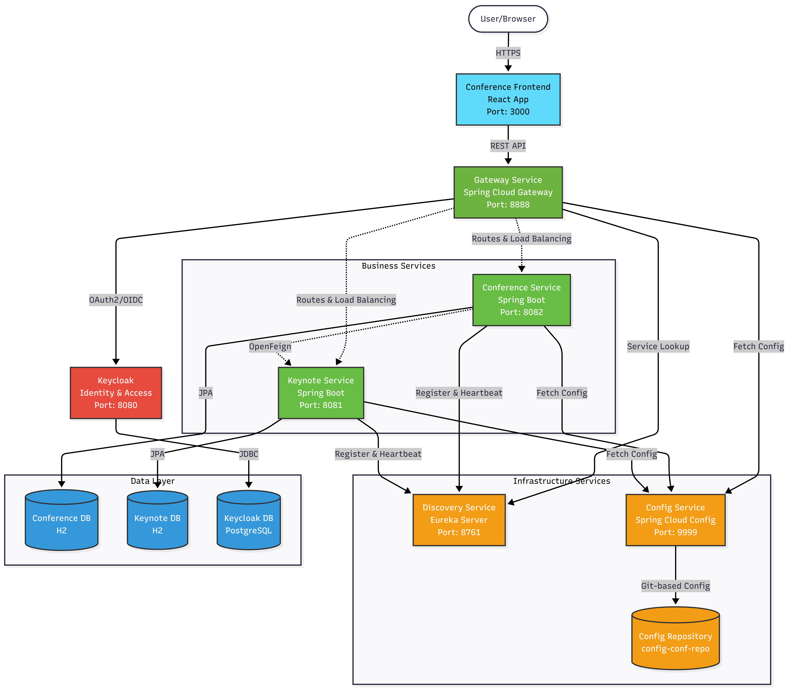
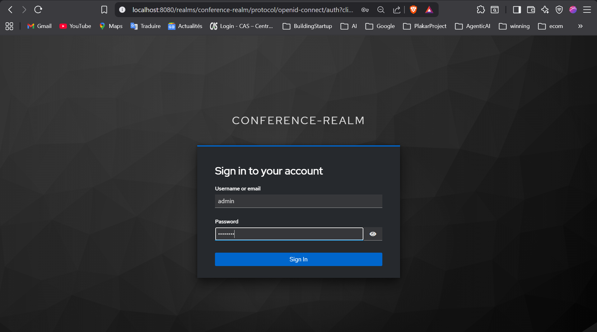
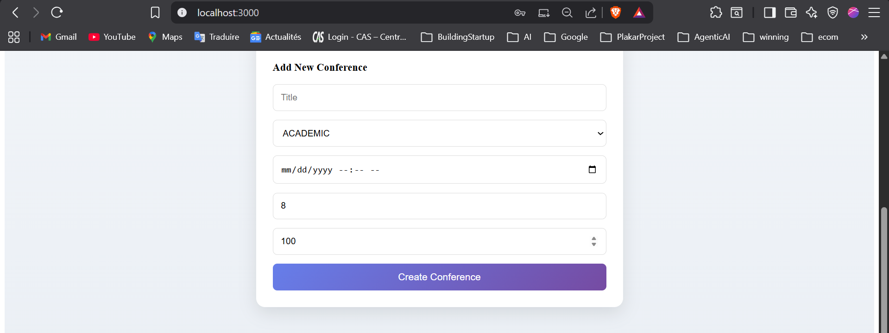
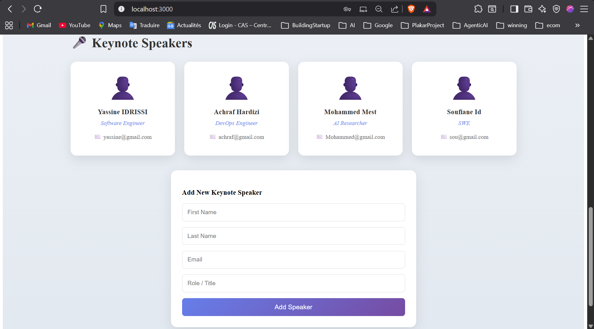
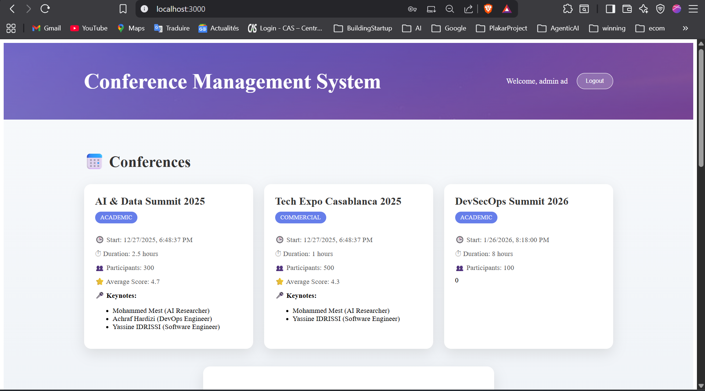
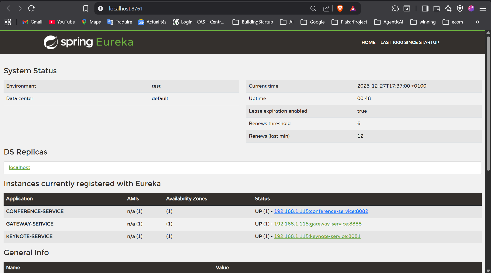
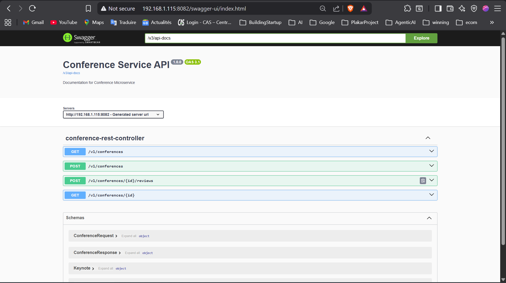
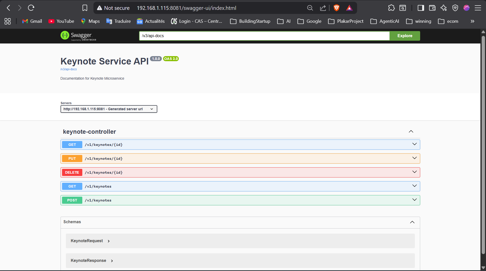

# Conference Microservices App

A full-stack microservices-based conference management system built with Spring Boot, React, and secured with Keycloak. The system supports conference creation, keynote speaker management, reviews, and user authentication/authorization.

---

## Table of Contents

- [Architecture Overview](#architecture-overview)
- [Features](#features)
- [Screenshots](#screenshots)
- [Services](#services)
  - [Gateway Service](#gateway-service)
  - [Conference Service](#conference-service)
  - [Keynote Service](#keynote-service)
  - [Config Service & Config Repo](#config-service--config-repo)
  - [Discovery Service](#discovery-service)
- [Frontend](#frontend)
- [Authentication & Authorization](#authentication--authorization)
- [Local Development & Docker](#local-development--docker)
- [API Documentation](#api-documentation)
- [Project Structure](#project-structure)

---

## Architecture Overview



### Architecture Components

**Frontend Layer:**
- **React Application** - Modern, responsive UI with OAuth2 integration via Keycloak JS adapter

**API Gateway:**
- **Spring Cloud Gateway** - Single entry point for all client requests
  - JWT token validation
  - Request routing and load balancing
  - CORS configuration
  - Circuit breaker patterns

**Business Services:**
- **Conference Service** - Manages conferences, reviews, and ratings
- **Keynote Service** - Handles keynote speaker information
- Communication via OpenFeign REST client

**Infrastructure Services:**
- **Eureka Discovery Service** - Dynamic service registration and discovery
- **Config Service** - Centralized configuration management with Git backend
- **Keycloak** - OAuth2/OIDC authentication and authorization server

**Data Layer:**
- H2 in-memory databases for development
- PostgreSQL for Keycloak in production

### Key Architectural Patterns

1. **API Gateway Pattern** - Centralized entry point for routing, security, and cross-cutting concerns
2. **Service Discovery** - Dynamic service registration and client-side load balancing via Eureka
3. **Externalized Configuration** - Git-backed centralized configuration with Spring Cloud Config
4. **Circuit Breaker** - Resilience patterns for fault tolerance
5. **OAuth2/OIDC Security** - Token-based authentication with Keycloak
6. **Database per Service** - Each microservice has its own database

### Technology Stack

- **Backend:** Spring Boot, Spring Cloud (Gateway, Config, Netflix Eureka)
- **Frontend:** React, Keycloak JS
- **Security:** Keycloak, OAuth2, JWT
- **Service Communication:** OpenFeign, REST
- **Data:** Spring Data JPA, H2 (dev)
- **Documentation:** Swagger/OpenAPI
- **Containerization:** Docker, Docker Compose

---

## Features

- User authentication (Keycloak, OAuth2)
- Create, list, and review conferences
- Manage keynote speakers
- Role-based access control (USER, ADMIN)
- API Gateway with JWT validation
- Service discovery and centralized configuration
- Responsive React frontend
- Easy local development with Docker Compose

---

## Screenshots

### 1. Login Page



### 2. Add Conference



### 3. Keynote Speaker



### 4. Conference Details



---

## Services

### Gateway Service

- **Path:** `gateway-service/`
- **Role:** API Gateway, security, routing, CORS, JWT validation
- **Tech:** Spring Cloud Gateway, WebFlux Security
- **Config:** See [`gateway-service/config/SecurityConfig.java`](gateway-service/src/main/java/com/yassine/gatewayservice/config/SecurityConfig.java)
- **Port:** `8888`

### Conference Service

- **Path:** `conference-service/`
- **Role:** Manages conferences, reviews, and links to keynote speakers
- **Tech:** Spring Boot, Spring Data JPA, OpenFeign, H2 (dev)
- **API:** `/v1/conferences`
- **Port:** `8082`
- **Swagger:** `/swagger-ui.html`

### Keynote Service

- **Path:** `keynote-service/`
- **Role:** Manages keynote speakers
- **Tech:** Spring Boot, Spring Data JPA, H2 (dev)
- **API:** `/v1/keynotes`
- **Port:** `8081`
- **Swagger:** `/swagger-ui.html`

### Config Service & Config Repo

- **Path:** `config-service/`, `config-conf-repo/`
- **Role:** Centralized configuration for all services
- **Tech:** Spring Cloud Config Server
- **Port:** `9999`
- **Repo:** `config-conf-repo/` (properties files)

### Discovery Service

- **Path:** `discovery-service/`
- **Role:** Eureka service registry for microservice discovery
- **Tech:** Spring Cloud Netflix Eureka
- **Port:** `8761`

---

## Frontend

- **Path:** `conference-frontend/`
- **Tech:** React, Keycloak JS, @react-keycloak/web
- **Features:** 
  - Login/logout via Keycloak
  - View/add conferences and keynote speakers
  - Responsive UI
- **Dev Server:** `http://localhost:3000`
- **API Gateway Proxy:** `http://localhost:8888`

---

## Authentication & Authorization

- **Keycloak** runs in Docker (`keycloak-persistent/`)
- **Realm:** `conference-realm`
- **Clients:** `react-frontend`, `conf-api`
- **Roles:** `USER`, `ADMIN`
- **JWT** tokens are validated at the API Gateway

**Keycloak Docker Compose:**  
See [`keycloak-persistent/docker-compose.yml`](keycloak-persistent/docker-compose.yml)

---

## Local Development & Docker

### Prerequisites

- Java 17+
- Node.js 18+
- Docker & Docker Compose

### Quick Start (Docker Compose)

1. **Start Keycloak:**
   ```sh
   cd keycloak-persistent
   docker-compose up -d
   ```
   - Access Keycloak admin: [http://localhost:8080](http://localhost:8080) (admin/admin)

2. **Start Config, Discovery, Backend Services:**
   ```sh
   ./mvnw clean package -DskipTests
   # In separate terminals or use Docker Compose for all Java services
   ```

3. **Start Frontend:**
   ```sh
   cd conference-frontend
   npm install
   npm start
   # App runs at http://localhost:3000
   ```

4. **Access Eureka Dashboard:**  
   [http://localhost:8761](http://localhost:8761)

   

5. **Access API Gateway:**  
   [http://localhost:8888](http://localhost:8888)

### Configuration

- All service ports and URLs are managed in `config-conf-repo/`
- H2 in-memory databases for dev (see `*.properties` files)

---

## API Documentation

- **Conference Service:** [http://localhost:8082/swagger-ui.html](http://localhost:8082/swagger-ui.html)



- **Keynote Service:** [http://localhost:8081/swagger-ui.html](http://localhost:8081/swagger-ui.html)



---

## Project Structure

```
conference-microservices-app/
│
├── conference-frontend/         # React frontend
├── conference-service/          # Conference microservice (Spring Boot)
├── keynote-service/             # Keynote microservice (Spring Boot)
├── gateway-service/             # API Gateway (Spring Cloud Gateway)
├── config-service/              # Config server (Spring Cloud Config)
├── config-conf-repo/            # Config repo (properties files)
├── discovery-service/           # Eureka service registry
├── keycloak-persistent/         # Keycloak Docker Compose setup
├── screenshots/                 # App screenshots for documentation
├── pom.xml                      # Parent Maven build file
└── ...
```

---
